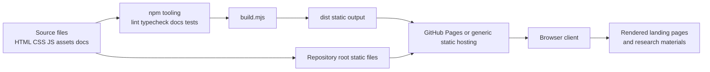

# Architecture

## Overview

This repository is a static front-end project for an academic landing page and a small set of supporting research materials. The production output is a collection of static files that can be hosted by GitHub Pages or any ordinary static web server.

## Main components

- Source pages: `index.html`, `en/index.html`, `materials/index.html`
- Shared presentation: `styles.css`
- Shared browser logic: `script.js`
- Pure helper logic: `script-helpers.mjs`
- Static assets: `assets/`, `favicon.svg`, `apple-touch-icon.png`, `site.webmanifest`
- Development and build tooling: `package.json`, `eslint.config.mjs`, `tsconfig.json`, `jsdoc.config.json`, `build.mjs`
- Generated outputs: `dist/`, `reference/`, `artifacts/jsdoc-reference.zip`
- Hosting target: GitHub Pages or another static file server

## Components not present

- Web application server: not used
- DBMS: not used
- Runtime cache service: not used
- Background worker or queue: not used
- User data storage: not used

The only server-side requirement is a static file host that can return HTML, CSS, JavaScript, images, and generated documentation files.

## Architecture diagram

## Delivery model

- During development, contributors work directly with source files in the repository root.
- `npm run check` validates code quality, type safety, and documentation examples.
- `npm run build` copies deployable static files into `dist/`.
- Deployment is file-based: either the repository root is published via GitHub Pages, or the `dist/` directory is copied to a static host.
